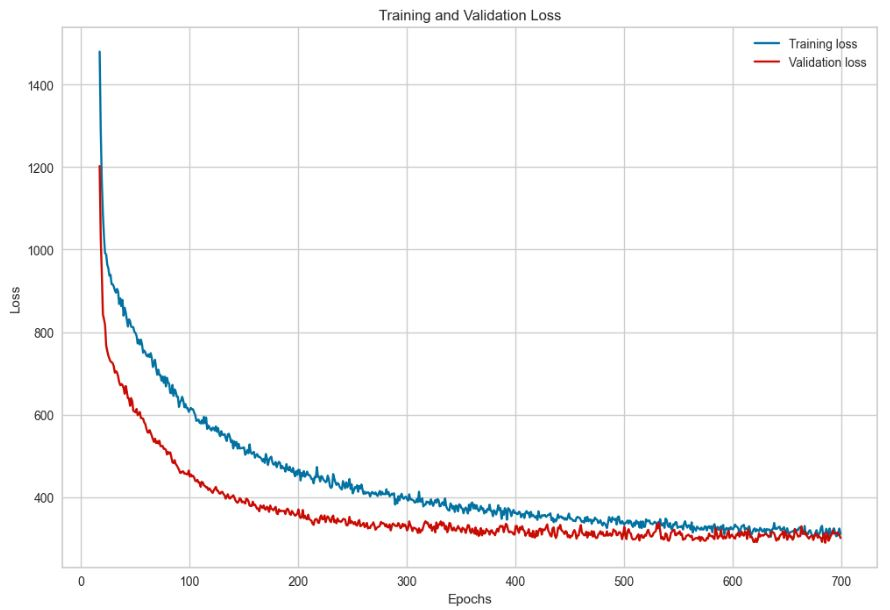
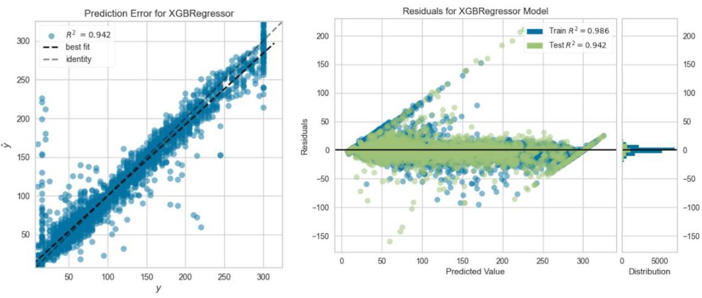
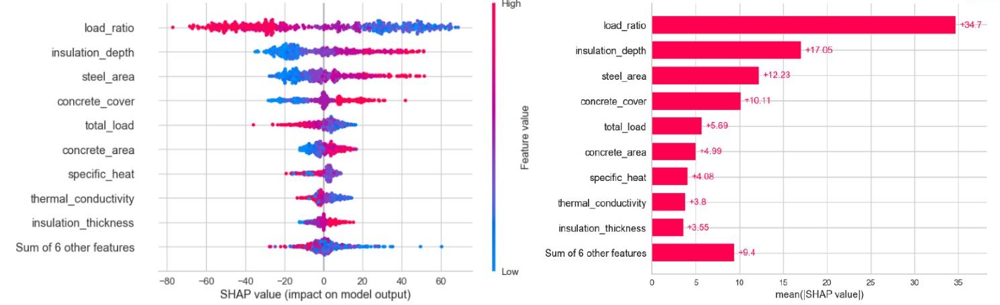

# Prediction of Fire Resistance of FRP-strengthened Concrete Beams using Machine Learning Techniques

Structural retrofitting of concrete buildings is necessitated by building aging, changes in occupancy, structural code updates, seismic events, and construction errors, with various techniques such as concrete jacketing, steel plate bonding, and Fiber Reinforced Polymer (FRP) application being utilized. FRP stands out due to its quick installation, lightweight nature, durability, and adaptability, but it suffers from diminished performance at *elevated temperatures* and potential adhesion failure. **Fire resistance** is defined as the duration for which a structural member sustains the applied loading under fire exposure. Assessing the fire resistance (in minutes) of FRP-strengthened concrete beams involve prescriptive codes, experimental tests, and numerical simulations, with challenges including cost and practicality. While experimental studies show enhanced capacities with insulation, full-scale tests are expensive, and numerical analysis requires specialized training and resources. Balancing cost, practicality, and accuracy is essential in selecting the most suitable fire resistance evaluation method.

Existing methodologies for determining the fire performance of FRP-strengthened concrete beams are often oversimplified and impractical, necessitating a more pragmatic approach such as the integration of machine learning (ML) algorithms and artificial intelligence (AI) in Fire Engineering and Sciences (FES). The key goals of incorporating ML and AI in FES include creating advanced fire assessment tools, enhancing knowledge-based methods, and utilizing computational power to tackle complex FES problems. This study aims to develop ML models capable of capturing the nonlinear characteristics involved in assessing beam fire resistance, with the intention of providing fire engineers with a complementary tool and exploring its potential for industry adoption.

## Summary

* Conducted feature engineering and exploratory data analysis to prepare the dataset for optimal utilization by machine learning models.
* Utilized **Scikit-learn** to evaluate candidate machine learning models, including Linear Regression with ElasticNet, Support Vector Regressor, Random Forest, and XGBoost, using diverse performance metrics (R^2, RMSE, MAE) for assessment.
* Employed **PyTorch** to design and train a five-layer Deep Neural Network with ReLU activation function and Adam optimizer, following a systematic evaluation of architecture over multiple iterations.
* Performed hyperparameter tuning using random search (RandomizedSearchCV) with five-fold cross validation, and achieved an R^2 of 94% and around 10% error relative to the mean for the best performing model. 
* Determined feature importance across all models using **SHAP** (SHapley Additive exPlanations) to provide valuable insights into the most important features driving the predictive performance of the models.

| Model                      | RMSE (minutes) | MAE (minutes) | R^2 (%) |
|----------------------------|----------------|---------------|---------|
| XGBoost                    |     17.82      |     9.87      |  0.942  |
| Random Forest              |     18.58      |     10.33     |  0.937  |
| Deep Neural Networks       |     17.66      |     12.15     |  0.942  |
| Support Vector Regressor   |     26.49      |     14.71     |  0.871  |
| Linear Regression          |     44.10      |     33.77     |  0.650  |

The findings of this research indicate that XGBoost demonstrates strong performance in overall fire resistance prediction, while Deep Neural Networks excel particularly in capturing extreme values of fire resistance. Key factors influencing fire resistance prediction include load ratio, insulation depth, steel area, concrete cover, and total load. By showcasing the effectiveness of machine learning methods, this study emphasizes their potential to address highly nonlinear problems in classical engineering domains where conventional knowledge-based approaches may prove impractical or unfeasible. The automated nature of these approaches holds promise for significant time and resource savings, reducing reliance on manual effort.

For an extensive discussion of model performance, feature significance, and real-world applicability of the developed models, please refer to this [research paper](https://nbviewer.org/github/cpmalenab/fire-resistance/blob/master/paper/Prediction%20of%20Fire%20Resistance%20of%20Fiber-Reinforced%20Polymer-Strengthened%20Concrete%20Beams%20Using%20Machine%20Learning%20Techniques.pdf).

## Tools

* Python libraries
    * Data analysis - Numpy, Scipy, Pandas, Seaborn, Matplotlib
* Machine Learning libraries
    * Machine Learning Models - [Scikit-Learn](https://scikit-learn.org/stable/), [XGBoost](https://xgboost.readthedocs.io/en/stable/)
    * Deep Neural Networks - [Pytorch](https://pytorch.org/)
    * Model Performance Viz - [Yellowbrick](https://www.scikit-yb.org/en/latest/)
    * Feature Importance Analysis - [SHAP](https://shap.readthedocs.io/en/latest/)

## Notebooks

* [Exploratory Data Analysis](https://nbviewer.org/github/cpmalenab/fire-resistance/blob/master/notebooks/Exploratory%20Data%20Analysis.ipynb) - contains data cleaning, feature engineering, and univariate up to multivariate analysis of the dataset.
* [Linear Regression](https://nbviewer.org/github/cpmalenab/fire-resistance/blob/master/notebooks/Linear%20Regression.ipynb), [Support Vector Regressor](https://nbviewer.org/github/cpmalenab/fire-resistance/blob/master/notebooks/Support%20Vector%20Regressor.ipynb), [Random Forest and XGBoost](https://nbviewer.org/github/cpmalenab/fire-resistance/blob/master/notebooks/Random%20Forest%20and%20XGBoost.ipynb)- covers base ML model initialization, hyperparameter tuning, feature importance anaylsis, and model error review of various models.
* [Deep Neural Networks](https://nbviewer.org/github/cpmalenab/fire-resistance/blob/master/notebooks/Deep%20Neural%20Networks.ipynb) - includes development of the neural network, class and function definitions for training/testing, and feature importance using SHAP DeepExplainer.

## Visualizations

## References

[1] Bhatt, P., Kodur, V., & Naser, M. (2024, February). “Dataset on fire resistance analysis of FRP-strengthened concrete beams”. Data in Brief, 52, 110031. https://doi.org/10.1016/j.dib.2024.110031

[2] Bhatt. (2021). “Fire Performance of FRP-strengthened Concrete Flexural Members”. MSU Libraries Digital Repository. https://doi.org/10.25335/d4ef-qv21

[3] Kodur, V. K. R., and Bhatt, P. P. (2018). “A Numerical Approach for Modeling Response of Fiber Reinforced Polymer Strengthened Concrete Slabs Exposed to Fire”, Composite Structures, 187, 226–240. 10.1016/j.compstruct.2017.12.051

